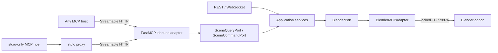

# Client-Neutral MCP Layer Implementation Plan

> **For agentic workers:** REQUIRED SUB-SKILL: Use superpowers:subagent-driven-development (recommended) or superpowers:executing-plans to implement this plan task-by-task. Steps use checkbox (`- [ ]`) syntax for tracking.

**Goal:** Add a standards-based MCP server layer that lets Codex, Claude, Cursor, VS Code, and other MCP hosts control Blender through the same secured application services without creating another Blender socket connection.

**Architecture:** Treat MCP as an inbound adapter beside REST and WebSocket. A transport-neutral FastMCP server depends only on `SceneQueryPort` and `SceneCommandPort`; `SceneOperationsService` implements those ports and delegates to the existing `BlenderPort`, whose adapter remains the single translation, sandbox, locking, and TCP chokepoint. Serve Streamable HTTP at `/mcp` in the existing FastAPI process and provide an optional stdio-to-HTTP proxy for hosts that cannot connect to remote HTTP.

**Tech Stack:** Python 3.11, FastAPI, FastMCP 3.4.x, MCP specification 2025-11-25, Pydantic v2 at the transport boundary, pytest/pytest-asyncio, Vite proxy, Tailscale identity gateway.

**Normative development docs:** Architecture/DDD/SOLID contracts live in [`docs/development/MCP_LAYER_DEVELOPMENT.md`](../../development/MCP_LAYER_DEVELOPMENT.md); TDD and mechanical verification contracts live in [`docs/development/MCP_LAYER_TDD.md`](../../development/MCP_LAYER_TDD.md); architectural rationale lives in [`docs/development/MCP_LAYER_ADR.md`](../../development/MCP_LAYER_ADR.md). This plan owns execution order and exact file changes only.

## Global Constraints

- The server is client-neutral: no Codex-, Claude-, Cursor-, or VS Code-specific branches in production code.
- Primary transport is MCP Streamable HTTP; do not add new legacy SSE endpoints.
- `/mcp` runs inside the existing API process and shares exactly one `BlenderPort` instance and its locked TCP connection to addon port `9876`.
- `src/core/**` must not import `fastmcp`, `fastapi`, Starlette, HTTP clients, or transport-specific types.
- Do not expose `execute_code`, a generic `call_tool`, arbitrary REST paths, or arbitrary `bpy` code as public MCP tools.
- Version-one tools are exactly: `blender_status`, `get_scene_info`, `get_object_info`, `get_viewport_screenshot`, `create_object`, `modify_object`, `delete_object`, and `apply_material`.
- Every tool has a title, a narrow input schema, an accurate description, a timeout, and correct `readOnlyHint`, `destructiveHint`, `idempotentHint`, and `openWorldHint` annotations.
- All structured tools return typed structured content plus the framework-generated text fallback; screenshots return standard MCP `ImageContent`.
- Remote access remains Tailnet-only through the existing `x-mes-identity` gate. OAuth, public-directory publication, MCP Apps/widgets, resources, prompts, sampling, text-to-3D, export, snapshots, and Poly Haven are outside this plan.
- Preserve `scripts/ci.sh` as the only CI entry point. `scripts/ci.sh --real` is the only gate allowed to require Blender on socket `9876`.
- Follow `docs/LESSONS_LEARNED.md`: no silent fallback, no mock-only claim that MCP changed Blender, and no second dispatch path around `BlenderMCPAdapter._dispatch`.

---

## Architecture and dependency direction



The MCP adapter is not permitted to import `BlenderMCPAdapter`, construct sockets, generate `bpy`, or call FastAPI routes. The application service speaks existing high-level commands; the existing adapter translates them to backend-specific `execute_code` only after sandbox validation.

## File map

- Create `src/core/domain/scene_operations.py`: immutable, stdlib-only request/result value objects shared by inbound ports.
- Create `src/core/ports/scene_operations_port.py`: split read and write Protocols.
- Create `src/core/use_cases/scene_operations.py`: application service that maps typed operations to `BlenderPort` calls and fails explicitly.
- Create `src/adapters/mcp_server/schemas.py`: strict Pydantic MCP input/output schemas; no domain behavior.
- Create `src/adapters/mcp_server/server.py`: client-neutral FastMCP tool registration and error mapping.
- Create `src/adapters/mcp_server/__init__.py`: exports only `create_mcp_server`.
- Create `api/runtime.py`: one composition-root object shared by REST, WebSocket, and MCP.
- Modify `api/main.py`: build runtime once, combine FastAPI/FastMCP lifespans, mount `/mcp`.
- Modify `api/routers/scene.py`: route the overlapping scene/object operations through `SceneOperationsService`.
- Modify `api/require_identity.py`: keep `/mcp` protected and document that only `/api/health` is exempt.
- Modify `web/vite.config.ts`: proxy `/blender/mcp` without rewriting MCP messages.
- Create `scripts/run_mcp_stdio_proxy.py`: generic stdio-to-HTTP bridge; never connects to port `9876`.
- Create `scripts/verify/mcp_verify_real.py`: real MCP interaction plus independent Blender oracle.
- Create `tests/unit/core/test_scene_operations.py`: use-case contract tests.
- Create `tests/unit/adapters/test_mcp_server.py`: in-memory MCP schema, annotations, tool, and error tests.
- Create `tests/e2e/test_mcp_streamable_http.py`: real ASGI Streamable HTTP and identity tests.
- Create `tests/unit/core/test_mcp_layer_boundaries.py`: AST dependency-direction sentinel.
- Modify `scripts/ci.sh`: add hermetic MCP tests to T2 and real MCP verification to T3.
- Create `docs/MCP_CLIENTS.md`: generic HTTP/stdio connection guide and compatibility matrix.
- Modify `README.md`, `docs/ARCHITECTURE.md`, `docs/INTEGRATION.md`: document the new inbound adapter and endpoint.

---

### Task 1: Add the client-neutral scene contracts

**Files:**
- Create: `src/core/domain/scene_operations.py`
- Create: `src/core/ports/scene_operations_port.py`
- Create: `tests/unit/core/test_scene_operation_contracts.py`
- Create: `tests/unit/core/test_mcp_layer_boundaries.py`

**Interfaces:**
- Produces: `ObjectType`, `Vector3`, `ColorRGBA`, `CreateObjectSpec`, `ModifyObjectSpec`, `MaterialSpec`, `SceneObjectSummary`, `SceneSummary`, `ObjectDetails`, `OperationReceipt`, `ViewportImage`, `BlenderStatus`.
- Produces: `SceneQueryPort` and `SceneCommandPort` Protocols used by the application service and MCP adapter.

- [ ] **Step 1: Write failing value-object and Protocol tests**

```python
from dataclasses import FrozenInstanceError

import pytest

from src.core.domain.scene_operations import CreateObjectSpec, ObjectType, Vector3
from src.core.ports.scene_operations_port import SceneCommandPort, SceneQueryPort


def test_scene_operation_values_are_immutable() -> None:
    spec = CreateObjectSpec(object_type=ObjectType.MESH, name="Cube", location=Vector3(1, 2, 3))
    with pytest.raises(FrozenInstanceError):
        spec.name = "Changed"  # type: ignore[misc]


def test_scene_ports_are_runtime_checkable() -> None:
    class BothPorts:
        async def status(self): return None
        async def get_scene_info(self): return None
        async def get_object_info(self, name): return None
        async def get_viewport_screenshot(self, max_size=800): return None
        async def create_object(self, spec): return None
        async def modify_object(self, spec): return None
        async def delete_object(self, name): return None
        async def apply_material(self, spec): return None

    service = BothPorts()
    assert isinstance(service, SceneQueryPort)
    assert isinstance(service, SceneCommandPort)
```

- [ ] **Step 2: Run the focused test and verify the missing-module failure**

Run: `~/miniconda3/envs/blender-mcp/bin/python -m pytest tests/unit/core/test_scene_operation_contracts.py -q --no-cov`

Expected: FAIL during collection with `ModuleNotFoundError: src.core.domain.scene_operations`.

- [ ] **Step 3: Implement pure immutable domain values**

```python
# src/core/domain/scene_operations.py
from __future__ import annotations

from dataclasses import dataclass
from enum import StrEnum


class ObjectType(StrEnum):
    MESH = "MESH"
    CURVE = "CURVE"
    LIGHT = "LIGHT"
    CAMERA = "CAMERA"


@dataclass(frozen=True, slots=True)
class Vector3:
    x: float = 0.0
    y: float = 0.0
    z: float = 0.0

    def as_list(self) -> list[float]:
        return [self.x, self.y, self.z]


@dataclass(frozen=True, slots=True)
class ColorRGBA:
    red: float
    green: float
    blue: float
    alpha: float = 1.0

    def as_list(self) -> list[float]:
        return [self.red, self.green, self.blue, self.alpha]


@dataclass(frozen=True, slots=True)
class CreateObjectSpec:
    object_type: ObjectType
    name: str | None = None
    location: Vector3 = Vector3()
    scale: Vector3 = Vector3(1.0, 1.0, 1.0)


@dataclass(frozen=True, slots=True)
class ModifyObjectSpec:
    name: str
    location: Vector3 | None = None
    rotation: Vector3 | None = None
    scale: Vector3 | None = None
    visible: bool | None = None


@dataclass(frozen=True, slots=True)
class MaterialSpec:
    object_name: str
    material_name: str
    color: ColorRGBA | None = None
    metallic: float | None = None
    roughness: float | None = None


@dataclass(frozen=True, slots=True)
class SceneObjectSummary:
    name: str
    object_type: str
    location: Vector3


@dataclass(frozen=True, slots=True)
class SceneSummary:
    name: str
    object_count: int
    materials_count: int
    objects: tuple[SceneObjectSummary, ...]


@dataclass(frozen=True, slots=True)
class ObjectDetails:
    name: str
    object_type: str
    location: Vector3
    rotation: Vector3
    scale: Vector3
    visible: bool
    materials: tuple[str, ...]


@dataclass(frozen=True, slots=True)
class OperationReceipt:
    operation: str
    object_name: str
    message: str


@dataclass(frozen=True, slots=True)
class ViewportImage:
    png_bytes: bytes
    width: int
    height: int


@dataclass(frozen=True, slots=True)
class BlenderStatus:
    connected: bool
    endpoint: str = "Blender addon socket"
```

- [ ] **Step 4: Implement split incoming ports**

```python
# src/core/ports/scene_operations_port.py
from __future__ import annotations

from typing import Protocol, runtime_checkable

from src.core.domain.scene_operations import (
    BlenderStatus, CreateObjectSpec, MaterialSpec, ModifyObjectSpec,
    ObjectDetails, OperationReceipt, SceneSummary, ViewportImage,
)


@runtime_checkable
class SceneQueryPort(Protocol):
    async def status(self) -> BlenderStatus: ...
    async def get_scene_info(self) -> SceneSummary: ...
    async def get_object_info(self, name: str) -> ObjectDetails: ...
    async def get_viewport_screenshot(self, max_size: int = 800) -> ViewportImage: ...


@runtime_checkable
class SceneCommandPort(Protocol):
    async def create_object(self, spec: CreateObjectSpec) -> OperationReceipt: ...
    async def modify_object(self, spec: ModifyObjectSpec) -> OperationReceipt: ...
    async def delete_object(self, name: str) -> OperationReceipt: ...
    async def apply_material(self, spec: MaterialSpec) -> OperationReceipt: ...
```

- [ ] **Step 5: Add a dependency-direction sentinel**

```python
# tests/unit/core/test_mcp_layer_boundaries.py
import ast
from pathlib import Path

import pytest


FORBIDDEN = {"fastapi", "fastmcp", "starlette", "httpx", "mcp"}
PURE_DOMAIN_FORBIDDEN = FORBIDDEN | {"pydantic", "yaml", "requests", "src"}


def forbidden_imports(path: Path, forbidden: set[str]) -> list[str]:
    tree = ast.parse(path.read_text(), filename=str(path))
    violations: list[str] = []
    for node in ast.walk(tree):
        if isinstance(node, ast.Import):
            names = [alias.name for alias in node.names]
        elif isinstance(node, ast.ImportFrom) and node.module:
            names = [node.module]
        else:
            names = []
        for name in names:
            root = name.split(".", 1)[0]
            if root in forbidden:
                violations.append(f"{path}:{node.lineno}:{name}")
    return violations


def test_core_does_not_import_mcp_or_http_frameworks() -> None:
    violations: list[str] = []
    for path in Path("src/core").rglob("*.py"):
        violations.extend(forbidden_imports(path, FORBIDDEN))
    assert violations == []


def test_new_scene_domain_values_are_stdlib_only() -> None:
    path = Path("src/core/domain/scene_operations.py")
    violations = forbidden_imports(path, PURE_DOMAIN_FORBIDDEN)
    assert violations == []


@pytest.mark.parametrize(
    "source",
    ["import fastmcp\n", "from pydantic import BaseModel\n", "from src.adapters.mcp import client\n"],
)
def test_import_sentinel_negative_fixture_fires(tmp_path: Path, source: str) -> None:
    bad_module = tmp_path / "bad_dependency.py"
    bad_module.write_text(source)
    assert forbidden_imports(bad_module, PURE_DOMAIN_FORBIDDEN) != []
```

Run the negative-fixture test once with `assert ... == []` and record the observed
failure before restoring the assertion above. This is required evidence that the
guard fires; merely committing the scanner is insufficient.

- [ ] **Step 6: Run tests and commit**

Run: `~/miniconda3/envs/blender-mcp/bin/python -m pytest tests/unit/core/test_scene_operation_contracts.py tests/unit/core/test_mcp_layer_boundaries.py -q --no-cov`

Expected: PASS.

```bash
git add src/core/domain/scene_operations.py src/core/ports/scene_operations_port.py tests/unit/core/test_scene_operation_contracts.py tests/unit/core/test_mcp_layer_boundaries.py
git commit -m "feat: define client-neutral scene operation ports"
```

---

### Task 2: Implement the shared scene application service

**Files:**
- Create: `src/core/use_cases/scene_operations.py`
- Modify: `src/core/domain/exceptions.py`
- Test: `tests/unit/core/test_scene_operations.py`

**Interfaces:**
- Consumes: `BlenderPort`, the domain values from Task 1, and existing `Command`/`ToolResult`.
- Produces: `SceneOperationsService`, the sole implementation injected into REST and MCP for the eight version-one operations.

- [ ] **Step 1: Write failing command-routing and explicit-error tests**

```python
import base64
from pathlib import Path

import pytest

from src.core.domain.command import Command
from src.core.domain.scene_operations import CreateObjectSpec, ObjectType
from src.core.ports.blender_port import BlenderPort
from src.core.ports.mcp_port import ToolResult
from src.core.use_cases.scene_operations import SceneOperationsService


class FakeBlender(BlenderPort):
    def __init__(self) -> None:
        self.result = ToolResult(True, "ok")
        self.commands: list[Command] = []
        self.calls: list[tuple[str, dict[str, object]]] = []

    async def connect(self) -> None: return None
    async def disconnect(self) -> None: return None
    async def is_connected(self) -> bool: return True
    async def get_scene_info(self) -> dict[str, object]:
        return {"name": "Scene", "object_count": 0, "materials_count": 0, "objects": []}
    async def execute(self, command: Command) -> ToolResult:
        self.commands.append(command)
        return self.result
    async def call_tool(self, tool_name: str, arguments: dict[str, object]) -> ToolResult:
        self.calls.append((tool_name, arguments))
        if tool_name == "get_viewport_screenshot":
            png = base64.b64decode("iVBORw0KGgoAAAANSUhEUgAAAAEAAAABCAYAAAAfFcSJAAAADUlEQVR42mNk+M9QDwADhgGAWjR9awAAAABJRU5ErkJggg==")
            Path(str(arguments["filepath"])).write_bytes(png)
            return ToolResult(True, {"width": 1, "height": 1})
        return self.result


@pytest.fixture
def fake_blender() -> FakeBlender:
    return FakeBlender()


@pytest.mark.asyncio
async def test_create_object_uses_high_level_command(fake_blender: FakeBlender) -> None:
    fake_blender.result = ToolResult(True, "created Cube")
    service = SceneOperationsService(fake_blender)
    receipt = await service.create_object(CreateObjectSpec(ObjectType.MESH, "Cube"))
    assert fake_blender.commands[0].tool_name == "create_object"
    assert fake_blender.commands[0].arguments == {
        "type": "MESH", "name": "Cube", "location": [0.0, 0.0, 0.0], "scale": [1.0, 1.0, 1.0]
    }
    assert receipt.object_name == "Cube"


@pytest.mark.asyncio
async def test_failed_tool_result_is_not_silently_converted(fake_blender: FakeBlender) -> None:
    from src.core.domain.exceptions import SceneOperationError
    fake_blender.result = ToolResult(False, None, "Object not found")
    service = SceneOperationsService(fake_blender)
    with pytest.raises(SceneOperationError, match="Object not found"):
        await service.delete_object("Ghost")


@pytest.mark.asyncio
async def test_scene_info_is_narrowed_to_domain_values(fake_blender: FakeBlender) -> None:
    scene = await SceneOperationsService(fake_blender).get_scene_info()
    assert scene.name == "Scene"
    assert scene.objects == ()


@pytest.mark.asyncio
async def test_object_info_is_narrowed_to_domain_values(fake_blender: FakeBlender) -> None:
    fake_blender.result = ToolResult(True, {
        "name": "Cube", "type": "MESH", "location": [0, 0, 0],
        "rotation": [0, 0, 0], "scale": [1, 1, 1], "visible": True, "materials": ["Red"],
    })
    details = await SceneOperationsService(fake_blender).get_object_info("Cube")
    assert details.name == "Cube"
    assert details.materials == ("Red",)


@pytest.mark.asyncio
async def test_screenshot_bytes_are_returned_and_temp_file_is_deleted(fake_blender: FakeBlender) -> None:
    shot = await SceneOperationsService(fake_blender).get_viewport_screenshot(800)
    screenshot_path = Path(str(fake_blender.calls[-1][1]["filepath"]))
    assert shot.png_bytes.startswith(b"\x89PNG")
    assert (shot.width, shot.height) == (1, 1)
    assert not screenshot_path.exists()
```

- [ ] **Step 2: Verify RED**

Run: `~/miniconda3/envs/blender-mcp/bin/python -m pytest tests/unit/core/test_scene_operations.py -q --no-cov`

Expected: FAIL with missing `SceneOperationsService`.

- [ ] **Step 3: Add an explicit application error**

```python
# append to src/core/domain/exceptions.py
class SceneOperationError(RuntimeError):
    """A requested scene operation failed with a recoverable, user-facing reason."""
```

- [ ] **Step 4: Implement the service and strict response narrowing**

```python
# src/core/use_cases/scene_operations.py
from __future__ import annotations

import os
import tempfile
from collections.abc import Mapping, Sequence

from src.core.domain.command import Command
from src.core.domain.exceptions import SceneOperationError
from src.core.domain.scene_operations import (
    BlenderStatus, ColorRGBA, CreateObjectSpec, MaterialSpec, ModifyObjectSpec,
    ObjectDetails, OperationReceipt, SceneObjectSummary, SceneSummary, Vector3, ViewportImage,
)
from src.core.ports.blender_port import BlenderPort
from src.core.ports.mcp_port import ToolResult


def _vector(value: object, field: str) -> Vector3:
    if not isinstance(value, Sequence) or isinstance(value, (str, bytes)) or len(value) != 3:
        raise SceneOperationError(f"Blender returned invalid {field}; expected three numbers")
    try:
        return Vector3(float(value[0]), float(value[1]), float(value[2]))
    except (TypeError, ValueError) as exc:
        raise SceneOperationError(f"Blender returned non-numeric {field}") from exc


def _require_mapping(value: object, context: str) -> dict[str, object]:
    if not isinstance(value, Mapping) or any(not isinstance(key, str) for key in value):
        raise SceneOperationError(f"Blender returned invalid {context}; expected an object")
    return {str(key): item for key, item in value.items()}


class SceneOperationsService:
    def __init__(self, blender: BlenderPort) -> None:
        self._blender = blender

    async def status(self) -> BlenderStatus:
        return BlenderStatus(connected=await self._blender.is_connected())

    async def get_scene_info(self) -> SceneSummary:
        raw = _require_mapping(await self._blender.get_scene_info(), "scene info")
        required = {"name", "object_count", "materials_count", "objects"}
        missing = sorted(required.difference(raw))
        if missing:
            raise SceneOperationError(f"Blender scene info is missing: {', '.join(missing)}")
        raw_objects = raw.get("objects", [])
        if not isinstance(raw_objects, Sequence) or isinstance(raw_objects, (str, bytes)):
            raise SceneOperationError("Blender returned invalid scene objects; expected a list")
        objects: list[SceneObjectSummary] = []
        for item in raw_objects:
            obj = _require_mapping(item, "scene object")
            objects.append(SceneObjectSummary(
                name=str(obj.get("name", "")),
                object_type=str(obj.get("type", "UNKNOWN")),
                location=_vector(obj.get("location"), "object location"),
            ))
        return SceneSummary(
            name=str(raw.get("name", "")),
            object_count=int(raw.get("object_count", len(objects))),
            materials_count=int(raw.get("materials_count", 0)),
            objects=tuple(objects),
        )

    async def get_object_info(self, name: str) -> ObjectDetails:
        result = await self._blender.call_tool("get_object_info", {"name": name})
        raw = _require_mapping(self._success(result, "get_object_info"), "object info")
        required = {"name", "type", "location", "rotation", "scale", "visible", "materials"}
        missing = sorted(required.difference(raw))
        if missing:
            raise SceneOperationError(f"Blender object info is missing: {', '.join(missing)}")
        materials = raw.get("materials", [])
        if not isinstance(materials, Sequence) or isinstance(materials, (str, bytes)):
            raise SceneOperationError("Blender returned invalid material names")
        return ObjectDetails(
            name=str(raw.get("name", name)), object_type=str(raw.get("type", "UNKNOWN")),
            location=_vector(raw.get("location"), "location"),
            rotation=_vector(raw.get("rotation"), "rotation"),
            scale=_vector(raw.get("scale"), "scale"),
            visible=bool(raw.get("visible", True)),
            materials=tuple(str(item) for item in materials),
        )

    async def get_viewport_screenshot(self, max_size: int = 800) -> ViewportImage:
        handle, path = tempfile.mkstemp(suffix=".png")
        os.close(handle)
        try:
            result = await self._blender.call_tool(
                "get_viewport_screenshot", {"filepath": path, "max_size": max_size, "format": "png"}
            )
            metadata = _require_mapping(self._success(result, "get_viewport_screenshot"), "screenshot metadata")
            if not os.path.exists(path):
                raise SceneOperationError("Blender reported a screenshot but created no PNG file")
            with open(path, "rb") as image_file:
                data = image_file.read()
            return ViewportImage(data, int(metadata.get("width", 0)), int(metadata.get("height", 0)))
        finally:
            if os.path.exists(path):
                os.unlink(path)

    async def create_object(self, spec: CreateObjectSpec) -> OperationReceipt:
        args: dict[str, object] = {
            "type": spec.object_type.value, "location": spec.location.as_list(), "scale": spec.scale.as_list()
        }
        if spec.name is not None:
            args["name"] = spec.name
        message = self._success(await self._blender.execute(Command(tool_name="create_object", arguments=args)), "create_object")
        return OperationReceipt("create_object", spec.name or "active object", str(message))

    async def modify_object(self, spec: ModifyObjectSpec) -> OperationReceipt:
        args: dict[str, object] = {"name": spec.name}
        for key, value in (("location", spec.location), ("rotation", spec.rotation), ("scale", spec.scale)):
            if value is not None:
                args[key] = value.as_list()
        if spec.visible is not None:
            args["visible"] = spec.visible
        message = self._success(await self._blender.execute(Command(tool_name="modify_object", arguments=args)), "modify_object")
        return OperationReceipt("modify_object", spec.name, str(message))

    async def delete_object(self, name: str) -> OperationReceipt:
        message = self._success(await self._blender.execute(Command(tool_name="delete_object", arguments={"name": name})), "delete_object")
        return OperationReceipt("delete_object", name, str(message))

    async def apply_material(self, spec: MaterialSpec) -> OperationReceipt:
        args: dict[str, object] = {"object_name": spec.object_name, "material_name": spec.material_name}
        if isinstance(spec.color, ColorRGBA):
            args["color"] = spec.color.as_list()
        if spec.metallic is not None:
            args["metallic"] = spec.metallic
        if spec.roughness is not None:
            args["roughness"] = spec.roughness
        message = self._success(await self._blender.execute(Command(tool_name="apply_material", arguments=args)), "apply_material")
        return OperationReceipt("apply_material", spec.object_name, str(message))

    @staticmethod
    def _success(result: ToolResult, operation: str) -> object:
        if not result.success:
            raise SceneOperationError(result.error or f"{operation} failed without an error message")
        return result.output
```

- [ ] **Step 5: Run service and existing adapter tests**

Run: `~/miniconda3/envs/blender-mcp/bin/python -m pytest tests/unit/core/test_scene_operations.py tests/unit/adapters/test_blender_mcp_adapter.py -q --no-cov`

Expected: PASS, including proof that high-level commands still reach the socket as sandboxed `execute_code`.

- [ ] **Step 6: Commit**

```bash
git add src/core/domain/exceptions.py src/core/use_cases/scene_operations.py tests/unit/core/test_scene_operations.py
git commit -m "feat: add shared Blender scene application service"
```

---

### Task 3: Build the transport-neutral FastMCP tool catalog

**Files:**
- Modify: `pyproject.toml`
- Modify: `environment.yml`
- Create: `src/adapters/mcp_server/__init__.py`
- Create: `src/adapters/mcp_server/schemas.py`
- Create: `src/adapters/mcp_server/server.py`
- Test: `tests/unit/adapters/test_mcp_server.py`

**Interfaces:**
- Consumes: `SceneQueryPort`, `SceneCommandPort`, and Task 1 domain values.
- Produces: `create_mcp_server(queries, commands) -> FastMCP` with the exact eight-tool catalog.

- [ ] **Step 1: Pin FastMCP 3.x in both dependency SSOTs**

Add `"fastmcp>=3.4,<4"` next to `"mcp"` in `pyproject.toml` and `fastmcp>=3.4,<4` next to `mcp` in `environment.yml`. Keep `mcp` because the project still contains an official SDK client adapter.

```diff
 dependencies = [
     "mcp",
+    "fastmcp>=3.4,<4",
     "anthropic",
```

```diff
   - pip:
     - mcp
+    - fastmcp>=3.4,<4
     - anthropic
```

Install the edited project into the existing development environment:

Run: `~/miniconda3/envs/blender-mcp/bin/python -m pip install -e '.[dev]'`

Expected: installation succeeds and `~/miniconda3/envs/blender-mcp/bin/python -c "import fastmcp; print(fastmcp.__version__)"` prints a `3.4.x` version.

- [ ] **Step 2: Write failing catalog and safety tests using the in-memory client**

```python
import pytest
from fastmcp import Client

from src.adapters.mcp_server import create_mcp_server
from src.core.domain.scene_operations import (
    BlenderStatus, ObjectDetails, OperationReceipt, SceneSummary, Vector3, ViewportImage,
)


EXPECTED = {
    "blender_status", "get_scene_info", "get_object_info", "get_viewport_screenshot",
    "create_object", "modify_object", "delete_object", "apply_material",
}


class FakeSceneService:
    def __init__(self) -> None:
        self.calls: list[str] = []

    async def status(self) -> BlenderStatus:
        self.calls.append("status")
        return BlenderStatus(True)
    async def get_scene_info(self) -> SceneSummary:
        self.calls.append("get_scene_info")
        return SceneSummary("Scene", 0, 0, ())
    async def get_object_info(self, name: str) -> ObjectDetails:
        self.calls.append("get_object_info")
        return ObjectDetails(name, "MESH", Vector3(), Vector3(), Vector3(1, 1, 1), True, ())
    async def get_viewport_screenshot(self, max_size: int = 800) -> ViewportImage:
        self.calls.append("get_viewport_screenshot")
        return ViewportImage(b"\x89PNG\r\n\x1a\n", 1, 1)
    async def create_object(self, spec) -> OperationReceipt:
        self.calls.append("create_object")
        return OperationReceipt("create_object", spec.name or "active object", "created")
    async def modify_object(self, spec) -> OperationReceipt:
        self.calls.append("modify_object")
        return OperationReceipt("modify_object", spec.name, "modified")
    async def delete_object(self, name: str) -> OperationReceipt:
        self.calls.append("delete_object")
        return OperationReceipt("delete_object", name, "deleted")
    async def apply_material(self, spec) -> OperationReceipt:
        self.calls.append("apply_material")
        return OperationReceipt("apply_material", spec.object_name, "applied")


@pytest.fixture
def fake_scene_service() -> FakeSceneService:
    return FakeSceneService()


@pytest.mark.asyncio
async def test_catalog_is_narrow_and_has_annotations(fake_scene_service: FakeSceneService) -> None:
    server = create_mcp_server(fake_scene_service, fake_scene_service)
    async with Client(server) as client:
        tools = await client.list_tools()
    assert {tool.name for tool in tools} == EXPECTED
    assert "execute_code" not in {tool.name for tool in tools}
    by_name = {tool.name: tool for tool in tools}
    assert by_name["get_scene_info"].annotations.readOnlyHint is True
    assert by_name["delete_object"].annotations.destructiveHint is True
    assert all(tool.annotations.title for tool in tools)


@pytest.mark.asyncio
async def test_invalid_color_is_rejected_before_service(fake_scene_service: FakeSceneService) -> None:
    server = create_mcp_server(fake_scene_service, fake_scene_service)
    async with Client(server) as client:
        result = await client.call_tool("apply_material", {
            "object_name": "Cube", "material_name": "Red", "color": [2.0, 0.0, 0.0, 1.0]
        })
    assert result.is_error
    assert fake_scene_service.calls == []
```

- [ ] **Step 3: Verify RED**

Run: `~/miniconda3/envs/blender-mcp/bin/python -m pytest tests/unit/adapters/test_mcp_server.py -q --no-cov`

Expected: FAIL because `src.adapters.mcp_server` does not exist.

- [ ] **Step 4: Add strict MCP boundary schemas**

```python
# src/adapters/mcp_server/schemas.py
from __future__ import annotations

from typing import Annotated, Literal
from pydantic import Field

Name = Annotated[str, Field(min_length=1, max_length=63)]
Vec3 = tuple[float, float, float]
RGBA = tuple[
    Annotated[float, Field(ge=0.0, le=1.0)],
    Annotated[float, Field(ge=0.0, le=1.0)],
    Annotated[float, Field(ge=0.0, le=1.0)],
    Annotated[float, Field(ge=0.0, le=1.0)],
]
ObjectTypeInput = Literal["MESH", "CURVE", "LIGHT", "CAMERA"]
UnitFloat = Annotated[float, Field(ge=0.0, le=1.0)]
MaxViewportSize = Annotated[int, Field(ge=200, le=1600)]
```

- [ ] **Step 5: Register all eight dedicated tools**

```python
# src/adapters/mcp_server/server.py
from __future__ import annotations

from fastmcp import FastMCP
from fastmcp.exceptions import ToolError
from fastmcp.utilities.types import Image
from mcp.types import ToolAnnotations

from src.adapters.mcp_server.schemas import MaxViewportSize, Name, ObjectTypeInput, RGBA, UnitFloat, Vec3
from src.core.domain.exceptions import BlenderConnectionError, SceneOperationError
from src.core.domain.scene_operations import (
    BlenderStatus, ColorRGBA, CreateObjectSpec, MaterialSpec, ModifyObjectSpec,
    ObjectDetails, ObjectType, OperationReceipt, SceneSummary, Vector3,
)
from src.core.ports.scene_operations_port import SceneCommandPort, SceneQueryPort


def _vec(value: tuple[float, float, float] | None) -> Vector3 | None:
    return None if value is None else Vector3(*value)


def _tool_error(exc: Exception) -> ToolError:
    if isinstance(exc, BlenderConnectionError):
        return ToolError("Blender is unavailable. Start Blender and enable the addon on port 9876.")
    return ToolError(str(exc))


def create_mcp_server(queries: SceneQueryPort, commands: SceneCommandPort) -> FastMCP:
    mcp = FastMCP(
        "blender-mcp-studio",
        instructions="Use dedicated scene tools; arbitrary Python execution is intentionally unavailable.",
        mask_error_details=True,
    )

    @mcp.tool(timeout=5.0, annotations=ToolAnnotations(title="Blender status", readOnlyHint=True, destructiveHint=False, idempotentHint=True, openWorldHint=False))
    async def blender_status() -> BlenderStatus:
        """Check whether the shared Blender addon connection is currently available."""
        return await queries.status()

    @mcp.tool(timeout=10.0, annotations=ToolAnnotations(title="Get scene info", readOnlyHint=True, destructiveHint=False, idempotentHint=True, openWorldHint=False))
    async def get_scene_info() -> SceneSummary:
        """Return the current Blender scene name, counts, and up to ten object summaries."""
        try:
            return await queries.get_scene_info()
        except (SceneOperationError, BlenderConnectionError) as exc:
            raise _tool_error(exc) from exc

    @mcp.tool(timeout=10.0, annotations=ToolAnnotations(title="Get object info", readOnlyHint=True, destructiveHint=False, idempotentHint=True, openWorldHint=False))
    async def get_object_info(name: Name) -> ObjectDetails:
        """Return transforms, visibility, and materials for one Blender object by exact name."""
        try:
            return await queries.get_object_info(name)
        except (SceneOperationError, BlenderConnectionError) as exc:
            raise _tool_error(exc) from exc

    @mcp.tool(timeout=30.0, annotations=ToolAnnotations(title="Get viewport screenshot", readOnlyHint=True, destructiveHint=False, idempotentHint=True, openWorldHint=False))
    async def get_viewport_screenshot(max_size: MaxViewportSize = 800) -> Image:
        """Capture the active Blender 3D viewport as a PNG, limited to 200-1600 pixels."""
        try:
            shot = await queries.get_viewport_screenshot(max_size)
            return Image(data=shot.png_bytes, format="png")
        except (SceneOperationError, BlenderConnectionError) as exc:
            raise _tool_error(exc) from exc

    @mcp.tool(timeout=30.0, annotations=ToolAnnotations(title="Create object", readOnlyHint=False, destructiveHint=False, idempotentHint=False, openWorldHint=False))
    async def create_object(
        object_type: ObjectTypeInput,
        name: Name | None = None,
        location: Vec3 = (0.0, 0.0, 0.0),
        scale: Vec3 = (1.0, 1.0, 1.0),
    ) -> OperationReceipt:
        """Create one cube mesh, Bezier curve, light, or camera with an optional name and transform."""
        try:
            return await commands.create_object(CreateObjectSpec(ObjectType(object_type), name, Vector3(*location), Vector3(*scale)))
        except (SceneOperationError, BlenderConnectionError) as exc:
            raise _tool_error(exc) from exc

    @mcp.tool(timeout=30.0, annotations=ToolAnnotations(title="Modify object", readOnlyHint=False, destructiveHint=True, idempotentHint=True, openWorldHint=False))
    async def modify_object(
        name: Name,
        location: Vec3 | None = None,
        rotation: Vec3 | None = None,
        scale: Vec3 | None = None,
        visible: bool | None = None,
    ) -> OperationReceipt:
        """Set selected transforms or visibility on one existing Blender object; omitted fields remain unchanged."""
        try:
            return await commands.modify_object(ModifyObjectSpec(name, _vec(location), _vec(rotation), _vec(scale), visible))
        except (SceneOperationError, BlenderConnectionError) as exc:
            raise _tool_error(exc) from exc

    @mcp.tool(timeout=30.0, annotations=ToolAnnotations(title="Delete object", readOnlyHint=False, destructiveHint=True, idempotentHint=False, openWorldHint=False))
    async def delete_object(name: Name) -> OperationReceipt:
        """Permanently remove one Blender object by exact name from the active scene."""
        try:
            return await commands.delete_object(name)
        except (SceneOperationError, BlenderConnectionError) as exc:
            raise _tool_error(exc) from exc

    @mcp.tool(timeout=30.0, annotations=ToolAnnotations(title="Apply material", readOnlyHint=False, destructiveHint=True, idempotentHint=False, openWorldHint=False))
    async def apply_material(
        object_name: Name,
        material_name: Name,
        color: RGBA | None = None,
        metallic: UnitFloat | None = None,
        roughness: UnitFloat | None = None,
    ) -> OperationReceipt:
        """Create or update a Principled BSDF material and apply it to one Blender object."""
        rgba = None if color is None else ColorRGBA(*color)
        try:
            return await commands.apply_material(MaterialSpec(object_name, material_name, rgba, metallic, roughness))
        except (SceneOperationError, BlenderConnectionError) as exc:
            raise _tool_error(exc) from exc

    return mcp
```

`src/adapters/mcp_server/__init__.py` contains only `from .server import create_mcp_server` and `__all__ = ["create_mcp_server"]`.

- [ ] **Step 6: Run catalog tests, lint, and commit**

Run: `~/miniconda3/envs/blender-mcp/bin/python -m pytest tests/unit/adapters/test_mcp_server.py -q --no-cov`

Run: `~/miniconda3/envs/blender-mcp/bin/python -m ruff check src/adapters/mcp_server tests/unit/adapters/test_mcp_server.py`

Expected: both PASS.

```bash
git add pyproject.toml environment.yml src/adapters/mcp_server tests/unit/adapters/test_mcp_server.py
git commit -m "feat: expose curated Blender tools over FastMCP"
```

---

### Task 4: Compose one runtime and mount Streamable HTTP

**Files:**
- Create: `api/runtime.py`
- Modify: `api/main.py`
- Modify: `api/routers/scene.py`
- Modify: `api/require_identity.py`
- Test: `tests/e2e/test_mcp_streamable_http.py`
- Test: `tests/e2e/test_require_identity.py`

**Interfaces:**
- Consumes: `create_mcp_server`, `SceneOperationsService`, and existing adapter factories.
- Produces: internal endpoint `http://127.0.0.1:19505/mcp` and a single shared runtime instance.

- [ ] **Step 1: Write a failing shared-runtime test**

```python
from unittest.mock import MagicMock

from fastapi.testclient import TestClient

from api.main import create_app
from api.runtime import AppRuntime
from src.core.domain.command import Command
from src.core.ports.blender_port import BlenderPort
from src.core.ports.mcp_port import ToolResult
from src.core.use_cases.scene_operations import SceneOperationsService


class CountingBlender(BlenderPort):
    def __init__(self) -> None:
        self.connect_calls = 0
        self.disconnect_calls = 0
    async def connect(self) -> None: self.connect_calls += 1
    async def disconnect(self) -> None: self.disconnect_calls += 1
    async def is_connected(self) -> bool: return True
    async def get_scene_info(self) -> dict[str, object]:
        return {"name": "Scene", "object_count": 0, "materials_count": 0, "objects": []}
    async def execute(self, command: Command) -> ToolResult: return ToolResult(True, "ok")
    async def call_tool(self, tool_name: str, arguments: dict[str, object]) -> ToolResult:
        return ToolResult(False, None, "unused by initialize test")


def make_fake_runtime() -> AppRuntime:
    blender = CountingBlender()
    marker = MagicMock()
    return AppRuntime(
        blender=blender, scene_operations=SceneOperationsService(blender),
        event_bus=marker, adapter_factory=marker, sandbox=marker, sanitizer=marker,
        vision=None, prompt_builder=marker, session_store=marker, snapshot_store=marker,
        polyhaven=marker, text3d=None,
    )


def test_rest_and_mcp_share_one_blender_connection() -> None:
    runtime = make_fake_runtime()
    app = create_app(runtime=runtime, require_identity=False)
    with TestClient(app) as client:
        assert client.get("/api/health").status_code == 200
        response = client.post("/mcp", headers={"accept": "application/json, text/event-stream"}, json={
            "jsonrpc": "2.0", "id": 1, "method": "initialize",
            "params": {"protocolVersion": "2025-11-25", "capabilities": {}, "clientInfo": {"name": "contract-test", "version": "1"}},
        })
        assert response.status_code == 200
    assert runtime.blender.connect_calls == 1
    assert runtime.blender.disconnect_calls == 1
```

- [ ] **Step 2: Introduce the composition-root runtime**

```python
# api/runtime.py
from __future__ import annotations

from dataclasses import dataclass
from pathlib import Path
from src.core.ports.adapter_factory_port import AdapterFactoryPort
from src.core.ports.blender_port import BlenderPort
from src.core.ports.code_sandbox_port import CodeSandboxPort
from src.core.ports.event_bus_port import EventBusPort
from src.core.ports.input_sanitizer_port import InputSanitizerPort
from src.core.ports.polyhaven_port import PolyHavenPort
from src.core.ports.prompt_builder_port import PromptBuilderPort
from src.core.ports.session_store_port import SessionStorePort
from src.core.ports.snapshot_store_port import SnapshotStorePort
from src.core.ports.text3d_port import Text3DGenerationPort
from src.core.ports.vision_port import VisionPort
from src.core.use_cases.scene_operations import SceneOperationsService


@dataclass(frozen=True, slots=True)
class AppRuntime:
    blender: BlenderPort
    scene_operations: SceneOperationsService
    event_bus: EventBusPort
    adapter_factory: AdapterFactoryPort
    sandbox: CodeSandboxPort
    sanitizer: InputSanitizerPort
    vision: VisionPort | None
    prompt_builder: PromptBuilderPort
    session_store: SessionStorePort
    snapshot_store: SnapshotStorePort
    polyhaven: PolyHavenPort
    text3d: Text3DGenerationPort | None


def build_runtime(env_file: Path | None = None) -> AppRuntime:
    from src.adapters.events.in_memory_event_bus import InMemoryEventBus
    from src.adapters.factory.concrete_adapter_factory import ConcreteAdapterFactory
    from src.adapters.mcp.factory import build_blender_adapter
    from src.adapters.polyhaven.polyhaven_adapter import PolyHavenAdapter
    from src.adapters.prompt.blender_context_prompt_builder import BlenderContextPromptBuilder
    from src.adapters.security.blender_code_sandbox import BlenderCodeSandbox
    from src.adapters.security.prompt_injection_sanitizer import PromptInjectionSanitizer
    from src.adapters.session.sqlite_session_store import SQLiteSessionStore
    from src.adapters.snapshot.sqlite_snapshot_store import SQLiteSnapshotStore
    from src.adapters.text3d.hunyuan3d_adapter import build_text3d_adapter
    from src.adapters.vision.factory import build_vision_adapter
    from src.infrastructure.env_loader import load_env

    load_env(env_file)
    sandbox = BlenderCodeSandbox()
    blender = build_blender_adapter(sandbox=sandbox)
    return AppRuntime(
        blender=blender, scene_operations=SceneOperationsService(blender),
        event_bus=InMemoryEventBus(), adapter_factory=ConcreteAdapterFactory(), sandbox=sandbox,
        sanitizer=PromptInjectionSanitizer(), vision=build_vision_adapter(),
        prompt_builder=BlenderContextPromptBuilder(), session_store=SQLiteSessionStore(),
        snapshot_store=SQLiteSnapshotStore(), polyhaven=PolyHavenAdapter(), text3d=build_text3d_adapter(),
    )
```

- [ ] **Step 3: Refactor `create_app` to accept and share `AppRuntime`**

In `api/main.py`, preserve existing `cors_origins`, `env_file`, and `require_identity` parameters and add `runtime: AppRuntime | None = None`. Build the runtime once, assign it to `app.state.runtime`, keep compatibility aliases such as `app.state.blender`, and have `_lifespan` connect/disconnect only `runtime.blender`.

Replace the current `contextlib.suppress(Exception)` around Blender connection with an explicit `except BlenderConnectionError as exc: logger.warning(...)`. The API may start while Blender is offline, but the degraded state must appear in logs and through `blender_status`; unexpected exception types must still fail startup.

```python
runtime = runtime or build_runtime(env_file)
mcp = create_mcp_server(runtime.scene_operations, runtime.scene_operations)
allowed_origins = origins
allowed_host_set = {"127.0.0.1", "localhost"}
for origin in origins:
    hostname = urlparse(origin).hostname
    if hostname is not None:
        allowed_host_set.add(hostname)
mcp_app = mcp.http_app(
    path="/", stateless_http=True,
    allowed_hosts=sorted(allowed_host_set),
    allowed_origins=allowed_origins,
)
lifespan = combine_lifespans(_lifespan, mcp_app.lifespan)
app = FastAPI(title="Blender MCP Studio API", version="0.1.0", lifespan=lifespan)
app.state.runtime = runtime
app.state.blender = runtime.blender
app.state.scene_operations = runtime.scene_operations
app.mount("/mcp", mcp_app)
```

Use imports from `urllib.parse`, `fastmcp.utilities.lifespan`, `api.runtime`, and `src.adapters.mcp_server`. Keep the mount protected by `RequireTailnetIdentity`; do not add `/mcp` to `_EXEMPT_PATHS`.

- [ ] **Step 4: Rewire overlapping REST operations to the same service**

Update `/api/scene`, `/api/object/{name}` modification/deletion, and preview code to call `request.app.state.scene_operations`. Convert `SceneOperationError` to actionable `HTTPException` responses. Do not keep duplicate inline `bpy` for operations the service now owns.

```python
@router.delete("/object/{name}")
async def delete_object(name: str, request: Request) -> dict[str, object]:
    try:
        receipt = await request.app.state.scene_operations.delete_object(name)
    except SceneOperationError as exc:
        raise HTTPException(status_code=422, detail=str(exc)) from exc
    return {"deleted": True, "name": receipt.object_name, "message": receipt.message}
```

For rename/select, retain the existing REST-only implementation because neither operation is in the version-one MCP contract. Split visibility updates so `visible` uses `modify_object`, while rename/select continues through the existing helper.

- [ ] **Step 5: Add identity and protocol tests**

Tests must assert:

```python
def test_mcp_requires_tailnet_identity() -> None:
    app = create_app(runtime=make_fake_runtime(), require_identity=True)
    request = {"jsonrpc": "2.0", "id": 1, "method": "initialize", "params": {
        "protocolVersion": "2025-11-25", "capabilities": {}, "clientInfo": {"name": "test", "version": "1"}
    }}
    with TestClient(app) as client:
        assert client.post("/mcp", json=request).status_code == 401
        assert client.post("/mcp", json=request, headers={"x-mes-identity": "tester@example.com", "accept": "application/json, text/event-stream"}).status_code == 200
```

Also assert an unsupported `MCP-Protocol-Version` receives HTTP 400, invalid `Origin` is rejected, and `/api/health` remains the only unauthenticated HTTP path.

- [ ] **Step 6: Run API/MCP regression tests and commit**

Run: `~/miniconda3/envs/blender-mcp/bin/python -m pytest tests/e2e/test_mcp_streamable_http.py tests/e2e/test_require_identity.py tests/unit/adapters/test_scene_graph.py -q --no-cov`

Expected: PASS.

```bash
git add api/runtime.py api/main.py api/routers/scene.py api/require_identity.py tests/e2e/test_mcp_streamable_http.py tests/e2e/test_require_identity.py
git commit -m "feat: mount shared Streamable HTTP MCP endpoint"
```

---

### Task 5: Expose the endpoint through `/blender` and add stdio compatibility

**Files:**
- Modify: `web/vite.config.ts`
- Create: `scripts/run_mcp_stdio_proxy.py`
- Create: `tests/unit/adapters/test_mcp_stdio_proxy.py`
- Modify: `deploy/launchd/README.md`

**Interfaces:**
- Produces: external Streamable HTTP URL `https://bearmacminimac-mini.tail56c751.ts.net/blender/mcp`.
- Produces: a stdio bridge configured only by `BLENDER_MCP_URL`; it forwards MCP and never imports the project Blender adapter.

- [ ] **Step 1: Add the Vite proxy before the `/blender/api` entry**

```typescript
'/blender/mcp': {
  target: 'http://localhost:19505',
  changeOrigin: false,
  rewrite: (path: string) => path.replace(/^\/blender/, ''),
},
```

The proxy must preserve `GET`, `POST`, `DELETE`, `Accept`, `MCP-Protocol-Version`, and `MCP-Session-Id`. Do not enable response buffering.

- [ ] **Step 2: Write and implement the stdio proxy**

```python
#!/usr/bin/env python3
from __future__ import annotations

import os
from fastmcp.server import create_proxy


DEFAULT_URL = "https://bearmacminimac-mini.tail56c751.ts.net/blender/mcp"


def main() -> None:
    url = os.environ.get("BLENDER_MCP_URL", DEFAULT_URL)
    proxy = create_proxy(url, name="blender-mcp-studio-stdio")
    proxy.run(transport="stdio")


if __name__ == "__main__":
    main()
```

The unit test monkeypatches `create_proxy`, calls `main()`, and asserts `run(transport="stdio")` and the chosen URL. Add a source inspection assertion that the script contains neither `9876` nor `BlenderMCPAdapter`.

- [ ] **Step 3: Build the frontend, run the proxy unit test, and commit**

Run: `cd web && npm run build`

Run: `~/miniconda3/envs/blender-mcp/bin/python -m pytest tests/unit/adapters/test_mcp_stdio_proxy.py -q --no-cov`

Expected: both PASS.

```bash
git add web/vite.config.ts scripts/run_mcp_stdio_proxy.py tests/unit/adapters/test_mcp_stdio_proxy.py deploy/launchd/README.md
git commit -m "feat: expose MCP route and stdio transport bridge"
```

---

### Task 6: Add discriminating protocol and safety verification

**Files:**
- Expand: `tests/unit/adapters/test_mcp_server.py`
- Expand: `tests/e2e/test_mcp_streamable_http.py`
- Modify: `scripts/ci.sh`

**Interfaces:**
- Verifies: tools/list schema quality, annotations, `structuredContent`, image content, error mapping, identity, origin, protocol negotiation, and one shared adapter instance.

- [ ] **Step 1: Add contract assertions for every tool**

The table-driven test must encode the exact policy:

```python
POLICY = {
    "blender_status": (True, False, True, False),
    "get_scene_info": (True, False, True, False),
    "get_object_info": (True, False, True, False),
    "get_viewport_screenshot": (True, False, True, False),
    "create_object": (False, False, False, False),
    "modify_object": (False, True, True, False),
    "delete_object": (False, True, False, False),
    "apply_material": (False, True, False, False),
}
```

For each listed tool, assert title exists, name length is at most 64, description is non-empty, and the four annotation flags equal the table. Assert `create_object`, `modify_object`, and `apply_material` schemas have `additionalProperties: false` after FastMCP schema generation.

- [ ] **Step 2: Test result content and recoverable errors**

Call `get_scene_info` and assert both `result.structured_content["name"]` and a text content block are present. Call `get_viewport_screenshot` and assert one image content block with MIME type `image/png`. Force `SceneOperationError("Object not found: Ghost")` and assert the tool result has `is_error=True` and the actionable message, not an HTTP 500 or traceback.

- [ ] **Step 3: Test client-name neutrality**

Parametrize initialize requests with `clientInfo.name` values `codex`, `claude-code`, `cursor`, `Visual Studio Code`, and `unknown-host`; assert identical capabilities and tool catalogs. This prevents client-name branching from entering production accidentally.

- [ ] **Step 4: Add MCP checks to the existing T2 gate**

Keep the single existing pytest invocation, because it already runs all `tests/unit` and `tests/e2e`. Add `src/adapters/mcp_server` and `api/runtime.py` to the existing ruff, format, mypy, and container-narrowing scopes by keeping them under the already-gated `src`/`api` roots. Add a comment beside T2 stating that the hermetic MCP tests exercise real MCP framing with fake Blender only.

- [ ] **Step 5: Run the full hermetic CI and commit**

Run: `scripts/ci.sh`

Expected: `CI PASSED — all hard gates green`; T3 explicitly skipped unless `--real` is supplied.

```bash
git add tests/unit/adapters/test_mcp_server.py tests/e2e/test_mcp_streamable_http.py scripts/ci.sh
git commit -m "test: gate MCP protocol and client neutrality"
```

---

### Task 7: Prove the real MCP-to-Blender path

**Files:**
- Create: `scripts/verify/mcp_verify_real.py`
- Modify: `scripts/ci.sh`
- Modify: `docs/verification/frontend-redesign/mcp-pipeline-verification-plan.md`

**Interfaces:**
- Interacts through: `https://bearmacminimac-mini.tail56c751.ts.net/blender/mcp` using Streamable HTTP.
- Independently observes through: raw addon socket `9876`, matching the existing real-verification doctrine.

- [ ] **Step 1: Implement a nonce-based real verifier**

The verifier must:

1. Exit with explicit `SKIP` and code 0 only when socket `9876` is not listening.
2. Generate `verify_mcp_<random>`.
3. Call MCP `create_object` with `MESH` and the nonce name.
4. Use a direct socket `execute_code` oracle to assert the object exists and has exactly eight vertices.
5. Call MCP `modify_object` with location `[1, 2, 3]`; use the oracle to assert those coordinates.
6. Call MCP `delete_object`; use the oracle to assert the nonce is gone.
7. Always remove remaining `verify_mcp_` objects in `finally`.
8. Print a compact evidence matrix and exit nonzero if any hypothesis fails.

Use `fastmcp.Client` for interaction and preserve the existing direct-socket JSON framing from `scripts/verify/mcp_verify_rest.py` for the oracle. Do not call REST scene/object endpoints in this verifier.

- [ ] **Step 2: Add the real MCP gate**

Inside the existing `if nc -z localhost 9876` T3 branch, run both discriminating checks:

```bash
_run hard "REST pipeline (nonce + independent oracle)" "$PY" scripts/verify/mcp_verify_rest.py
_run hard "MCP protocol (nonce + independent oracle)" "$PY" scripts/verify/mcp_verify_real.py
```

- [ ] **Step 3: Run hermetic CI, then real CI with Blender available**

Run: `scripts/ci.sh`

Expected: PASS with T3 skipped.

Run after starting Blender: `scripts/ci.sh --real`

Expected: PASS for both REST and MCP nonce/oracle gates; final oracle contains no `verify_mcp_` object.

- [ ] **Step 4: Commit**

```bash
git add scripts/verify/mcp_verify_real.py scripts/ci.sh docs/verification/frontend-redesign/mcp-pipeline-verification-plan.md
git commit -m "test: verify real MCP to Blender mutations"
```

---

### Task 8: Document client-neutral operation and ownership boundaries

**Files:**
- Create: `docs/MCP_CLIENTS.md`
- Modify: `README.md`
- Modify: `docs/ARCHITECTURE.md`
- Modify: `docs/INTEGRATION.md`
- Modify: `docs/TECH_SPEC.md`

**Interfaces:**
- Documents: one canonical HTTP URL, one optional stdio command, the eight-tool catalog, auth behavior, compatibility test method, and non-goals.

- [ ] **Step 1: Write the generic connection contract**

`docs/MCP_CLIENTS.md` must begin with:

```markdown
# MCP clients

Blender MCP Studio exposes standard MCP Streamable HTTP at:

`https://bearmacminimac-mini.tail56c751.ts.net/blender/mcp`

The server does not detect or special-case the MCP host. Any client that supports
MCP Streamable HTTP can use the URL while authenticated to the Tailnet.

For a client that only launches stdio servers, run:

`~/miniconda3/envs/blender-mcp/bin/python scripts/run_mcp_stdio_proxy.py`

The stdio process proxies the HTTP MCP endpoint; it does not open another Blender
socket and can coexist with the Web UI and REST API.
```

Add a table covering Streamable HTTP, stdio proxy, Tailnet requirement, screenshots, structured output, and destructive confirmations. Include generic JSON stdio configuration using the absolute Python/script paths and `BLENDER_MCP_URL`, plus separate host-specific examples clearly labeled as configuration examples rather than server requirements.

- [ ] **Step 2: Update architecture and integration diagrams**

Show MCP as an inbound adapter, `/blender/mcp` proxying to API `19505`, and the single shared `BlenderMCPAdapter`/socket. Replace any statement that the project merely offers an “MCP-style HTTP API” with the distinction between the REST API and standards-compliant MCP endpoint.

- [ ] **Step 3: Document security and explicit non-goals**

State that:

- `/mcp` is Tailnet-authenticated and is not exempt from identity middleware.
- Tool annotations are advisory UX hints, not authorization.
- `execute_code` is deliberately absent even though it exists internally.
- Public Internet distribution requires a separate OAuth 2.1/CIMD design and is not authorized by this implementation.
- Legacy SSE is not exposed.
- Client identity strings are used only for logs/telemetry and never authorization.

- [ ] **Step 4: Run documentation-sensitive gates and commit**

Run: `scripts/ci.sh`

Expected: PASS.

```bash
git add docs/MCP_CLIENTS.md README.md docs/ARCHITECTURE.md docs/INTEGRATION.md docs/TECH_SPEC.md
git commit -m "docs: describe client-neutral MCP integration"
```

---

## Acceptance criteria

- `tools/list` returns exactly the eight documented tools with stable schemas and annotations.
- A client calling `/blender/mcp` can initialize, list tools, read scene data, receive an image, create/modify/delete an object, and apply a material.
- The same catalog is returned for at least five different `clientInfo.name` values.
- `execute_code`, raw socket tools, arbitrary endpoints, and free-form action dispatch are absent.
- REST, WebSocket, and MCP share one `BlenderPort`; startup calls `connect()` once.
- Concurrent requests are serialized by the existing `BlenderSocketClient._lock` rather than by a new transport-specific lock.
- Missing Blender, invalid Blender response shapes, missing objects, invalid tool inputs, unsupported protocol versions, invalid origins, and missing Tailnet identity all fail visibly and actionably.
- `scripts/ci.sh` passes hermetically.
- `scripts/ci.sh --real` proves MCP mutation through an independent socket oracle and cleans up its nonce objects.
- Both the remote Streamable HTTP endpoint and stdio proxy are documented without making the server depend on any specific MCP host.

## Explicit follow-up boundary

A public multi-user connector is a separate product decision. It requires OAuth 2.1 authorization-server metadata/CIMD, per-user authorization, audit logging, rate limits, privacy documentation, and public hosting. None of those concerns should be pre-built into this Tailnet-only version; add them only when a real public-user requirement exists.

## Reference baseline

- MCP specification 2025-11-25: Streamable HTTP, lifecycle negotiation, tools, structured content, and tool annotations.
- FastMCP 3.4 documentation: FastAPI mounting, combined lifespans, host/origin protection, in-memory client testing, media helpers, structured output, and HTTP-to-stdio proxying.
- Claude connector documentation: Streamable HTTP preferred over legacy SSE, read/write separation, annotations, narrow descriptions, and real-client testing. These requirements are treated as compatibility quality gates, not as Claude-specific server behavior.
