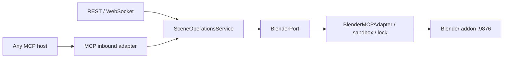

# ADR-005: Client-neutral MCP is an inbound adapter

**Status:** Proposed

**Date:** 2026-07-18

**Decision owners:** Blender MCP Studio maintainers

## Context

專案目前的 Blender control path 是 FastAPI/application code經 `BlenderMCPAdapter` 連到 addon TCP `9876`。雖然內部類別與專案名稱使用 MCP 字樣，對外並沒有可讓標準 MCP host initialize、`tools/list`、`tools/call` 的 endpoint。

需求是讓 Codex以外的MCP host也能使用，同時保留：

- existing FastAPI/WebSocket UI。
- single Blender socket ownership。
- existing high-level-command translation與code sandbox。
- Tailnet-only identity boundary。
- DDD/SOLID dependency direction。

## Decision

MCP被定義為新的 inbound adapter，不是新的 Blender backend。

在既有 FastAPI process mount curated FastMCP Streamable HTTP server。MCP adapter只依賴 `SceneQueryPort`與`SceneCommandPort`，兩者由shared `SceneOperationsService`實作；service再依賴既有 `BlenderPort`。

stdio-only host使用local HTTP-to-stdio proxy，proxy轉送到同一 Streamable HTTP endpoint，不import scene service、不連socket `9876`。

## Decision constraints

- Public catalog固定為規範中的八個dedicated tools。
- 不公開 `execute_code`、generic dispatcher或arbitrary REST path。
- Primary transport是Streamable HTTP；不新增legacy SSE。
- Production code不得依`clientInfo.name`分支。
- REST/MCP必須共用同一runtime與BlenderPort instance。
- Tool annotations只做UX hint，不取代authorization。
- ADR status只有real verifier通過後才能改為Accepted。

## Alternatives considered

### A. Codex-specific wrapper

**Rejected.** 它最快，但把tool contract與Codex config耦合，其他host需重做adapter，直接違反client-neutral需求。

### B. Auto-convert all FastAPI/OpenAPI endpoints

**Rejected.** 現有API包含chat、pipeline、generation、snapshot與其他不同risk operations。自動轉換會產生過大catalog、鬆散schema、模糊read/write boundary，也可能意外暴露高權限endpoint。

### C. Standalone MCP process直接連addon `9876`

**Rejected.** 它形成第二個socket lifecycle/security owner，與API process競爭或平行繞過shared sandbox；「兩個都能連」不等於「一個政策」或「一個順序」。

### D. Legacy HTTP+SSE

**Rejected.** 新server以MCP Streamable HTTP為主；為未出現的legacy client預建雙transport增加測試與routing成本，違反YAGNI。

### E. Public `execute_code`

**Rejected.** 這會把untrusted tool input直接提升為local arbitrary Python/`bpy` execution。即使有sandbox，也不應以一個broad tool取代窄capability schema。

### F. stdio-only server

**Rejected as primary; accepted as proxy compatibility.** stdio適合單機client，但每個host需啟動process，且無法自然服務遠端/Tailnet client。作為HTTP proxy可保留相容性而不複製backend ownership。

## Consequences

### Positive

- Host neutrality：任何支援標準transport的host看到相同catalog。
- Single owner：REST、WebSocket、MCP共用connection、lock與sandbox。
- Typed contract：input/output/annotations可被protocol test。
- Incremental migration：既有UI與REST不需一次重寫。

### Negative

- 新增 FastMCP 3.x dependency。
- FastAPI與FastMCP lifespan必須正確組合。
- Vite/MacHomeHub sub-path與identity/header forwarding多一條integration path。
- Application與adapter boundary需補typed values與narrowing tests。

### Neutral / deferred

- 公網multi-user connector仍需OAuth 2.1、per-user authorization、audit/rate-limit與privacy policy的獨立ADR。
- Resources/prompts/widgets不因本決策自動納入。

## Enforcement

此ADR不是由文件本身保證。下列mechanical evidence缺一不可：

- exact tool catalog/policy test。
- AST layer/constructor/bpy sentinels，且negative fixtures證明會fire。
- production assembly test證明shared instance與single connect。
- HTTP identity/Origin/protocol tests。
- HTTP/stdio transport equivalence test。
- `scripts/ci.sh --real`的MCP mutation + independent socket oracle。

詳細gate由 [MCP_LAYER_TDD.md](MCP_LAYER_TDD.md) 擁有。

## Status transition

- **Proposed → Accepted:** `MCP_LAYER_DEVELOPMENT.md` Definition of Done全部通過，且真機evidence已保存。
- **Accepted → Superseded:** 新ADR明確取代本決策並附migration plan。
- **Accepted → Deprecated:** MCP endpoint停止提供，但仍在相容期；必須記錄removal date與client impact。

禁止因class/server已存在就改成Accepted；production assembly與real oracle才是存在證據。
