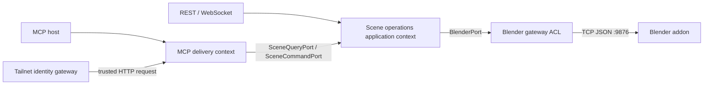
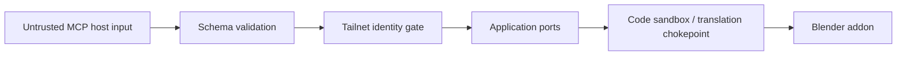

# Client-neutral MCP layer 開發規範

> 狀態：Target design，尚未部署。完成條件見本文「Definition of Done」與 [MCP_LAYER_TDD.md](MCP_LAYER_TDD.md)。

## 1. 目的
Blender MCP Studio 需要一個真正符合 Model Context Protocol 的入口，讓任何相容 MCP host 都能控制 Blender，而不是只讓 Codex 使用，也不是把既有 REST API 換個名字叫 MCP。

這一層的目的只有三個：

1. 把穩定、窄化、可驗證的 Blender scene capability 暴露成 MCP tools。
2. 讓 MCP、REST、WebSocket 共用同一套 application service、security policy 與 Blender socket。
3. 隔離 MCP transport／SDK，使 domain 與 application logic 不知道呼叫者是 Codex、Claude、Cursor、VS Code 或其他 host。

## 2. 規範語言
- **MUST / MUST NOT**：違反時必須有測試、AST sentinel 或 CI gate 變紅。
- **SHOULD / SHOULD NOT**：可例外，但 PR 必須記錄理由與替代驗證。
- **MAY**：不影響契約的選項。
- 本文件說明「應該建成什麼」；逐檔實作順序由 [implementation plan](../superpowers/plans/2026-07-18-client-neutral-mcp-layer.md) 負責。

## 3. Scope

### 3.1 Version-one capability
公開工具固定為八個：

1. `blender_status`
2. `get_scene_info`
3. `get_object_info`
4. `get_viewport_screenshot`
5. `create_object`
6. `modify_object`
7. `delete_object`
8. `apply_material`

主要 transport 是 Streamable HTTP：

- API 內部：`http://127.0.0.1:19505/mcp`
- Tailnet 外部：`https://bearmacminimac-mini.tail56c751.ts.net/blender/mcp`
- stdio-only host：啟動本地 HTTP-to-stdio proxy，仍轉回上述 MCP HTTP endpoint。

### 3.2 Explicit non-goals

Version one 不包含：

- 公開 `execute_code`、自由格式 `bpy`、通用 `call_tool` 或 `execute_action`。
- 自動把全部 REST/OpenAPI endpoint 轉成 tools。
- legacy HTTP+SSE endpoint。
- 公網匿名服務、OAuth 2.1、公開 connector directory、多租戶授權。
- MCP resources、prompts、sampling、elicitation 或 MCP App widgets。
- Hunyuan3D、Poly Haven、snapshot、export、pipeline、undo/redo。
- 依據 `clientInfo.name` 改變工具、schema、權限或回傳。

這些不是預留的空殼。出現第二個真實需求前不得先建抽象；這是 YAGNI gate。

## 4. Ubiquitous language

| 名詞 | 唯一定義 |
|---|---|
| MCP host | 發起 MCP lifecycle、列出並呼叫 tools 的 client，例如 Codex 或 Claude；不是授權身分來源 |
| MCP inbound adapter | 把 MCP request 轉成 application port 呼叫的外層 adapter |
| Scene query | 不改變 Blender scene 的讀取操作 |
| Scene command | 會建立、修改或刪除 scene state 的操作 |
| Operation receipt | command 成功後的 immutable 結果，包含 operation、object name 與 message |
| Scene operations service | 實作 scene query/command use cases 的 application service |
| Blender gateway | 實作 `BlenderPort`、隔離 addon raw JSON／TCP／`bpy` 方言的 anti-corruption layer |
| Runtime | composition root 建立、持有並管理一次生命週期的 adapter/service 集合 |
| Oracle | 不經被測入口、用另一條觀測路徑取得的真值；真機測試使用 direct addon socket |
| Tool catalog | MCP client 經 `tools/list` 實際取得的公開工具集合，不是文件裡宣稱的集合 |

同一 bounded context 內不得用「MCP server」同時指 raw addon socket 與標準 MCP endpoint。本文稱前者為 **Blender addon socket**，後者為 **MCP endpoint**。

## 5. Bounded contexts 與 context map

### 5.1 MCP delivery context

責任：

- MCP lifecycle、Streamable HTTP、stdio proxy。
- tool name、description、input/output schema、annotations。
- MCP error 與 content blocks。
- Host／Origin transport protection。

不得擁有：

- Blender socket。
- `bpy` code generation。
- scene business decisions。
- Tailnet identity 的信任建立。

### 5.2 Scene operations application context

責任：

- 將 typed scene query/command 轉為 `BlenderPort` 呼叫。
- 將外部 raw result 窄化成 immutable domain value objects。
- 明確失敗，不把異常回覆變成 `{}`、`None` 或假成功。

不得擁有：

- FastMCP、FastAPI、HTTP、MCP content types。
- socket 或 `bpy` dialect。
- client-specific behavior。

### 5.3 Blender gateway context

責任：

- addon TCP protocol 與 connection lifecycle。
- high-level tool 到 backend-specific `execute_code` 的 translation。
- code sandbox、single dispatch chokepoint、concurrency lock。
- addon response decoding。

它是 anti-corruption layer：raw addon JSON 不得直接成為 MCP output schema 或 domain model。

### 5.4 Identity/gateway context

責任：

- Tailscale／MacHomeHub 建立可信任的 `x-mes-identity`。
- 移除 client spoofed identity header。
- reverse proxy `/blender/mcp` 到 API `/mcp`。

MCP layer 只消費已建立的 identity；不得把 unauthenticated `clientInfo` 當 authorization input。

### 5.5 Context map



## 6. Hexagonal dependency rule

允許的 dependency direction：

```text
api / MCP delivery adapter
            |
            v
application use cases -> domain values
            |
            v
       output ports
            ^
            |
 Blender / storage adapters
```

### 6.1 Mechanical rules

| Rule | Mechanical enforcement |
|---|---|
| `src/core/**` 不得 import FastMCP、FastAPI、Starlette、MCP SDK 或 HTTP client | AST layer-direction sentinel |
| 新增的 `src/core/domain/scene_operations.py` 只可 import stdlib與同層domain | AST domain-purity sentinel |
| MCP adapter 不得 import `BlenderMCPAdapter` 或 `BlenderSocketClient` | AST forbidden-import test |
| MCP adapter 不得生成包含 `bpy` 的 code | AST/string sentinel scoped to `src/adapters/mcp_server/**` |
| Production socket constructor 只能由 Blender adapter/composition root 擁有 | AST constructor-exclusivity test |
| REST 與 MCP 必須取得同一個 `SceneOperationsService` 與 `BlenderPort` instance | assembly test with identity assertion and connect-count assertion |
| stdio proxy 不得連 `9876` | source sentinel plus proxy integration test |

如果無法指出「哪個 test 會紅」，就不得聲稱 dependency 已解耦。

### 6.2 Existing domain debt ratchet

既有 `src/core/domain/command.py`、`scene.py` 與 `session.py` 使用 Pydantic；本次不趁機重構不相關 domain，但也不得把這個既有例外擴散到新的 MCP scene values。

Domain-purity sentinel採 ratchet：

- 新檔 `scene_operations.py` 的 third-party import allowlist為空。
- 既有例外若建立全域allowlist，必須逐檔列出並在CI loud output；只可縮小。
- 既有檔移除third-party dependency後，stale allowlist entry必須讓test失敗，迫使刪除豁免。
- 禁止以「專案本來就用了Pydantic」作為新domain DTO繼續使用的理由。

## 7. DDD tactical model

### 7.1 Value objects

下列型別是 immutable value objects，使用 stdlib frozen dataclass，不使用 Pydantic：

- `Vector3`
- `ColorRGBA`
- `CreateObjectSpec`
- `ModifyObjectSpec`
- `MaterialSpec`
- `SceneObjectSummary`
- `SceneSummary`
- `ObjectDetails`
- `OperationReceipt`
- `ViewportImage`
- `BlenderStatus`

理由：它們沒有獨立 identity，以值相等；跨 application boundary 後不應被原地修改。

### 7.2 Entity / Aggregate decision

Version one 不新增 entity 或 repository：

- Blender scene 的 identity 與 transaction boundary 仍由 Blender 管理。
- MCP request 不持久化另一份 scene aggregate，避免兩個可編輯 SSOT。
- `SceneSummary` 是 query snapshot，不是第二個 scene aggregate root。

若未來需要離線 scene state、versioning 或 collaborative editing，必須另開 bounded-context/aggregate ADR；不得把 `SceneSummary` 偷偷變成 mutable cache。

### 7.3 Anti-corruption boundary

TCP JSON envelope、`status/result/message`等 addon wire shape只能存在於 Blender adapter。Adapter先重建為 `dict[str, object]`的normalized port result；application narrowing再把 `name/object_count/materials_count`等 scene semantics轉成domain values。任何未窄化mapping都不得進入domain value object。

必要欄位缺失、容器 shape 錯誤、vector 非三個數字時，MUST raise `SceneOperationError`。禁止：

```python
return raw if isinstance(raw, dict) else {}
```

也禁止把 third-party field bag 原樣回傳給 MCP client。

## 8. Incoming ports 與 CQS

### 8.1 `SceneQueryPort`

```python
@runtime_checkable
class SceneQueryPort(Protocol):
    async def status(self) -> BlenderStatus: ...
    async def get_scene_info(self) -> SceneSummary: ...
    async def get_object_info(self, name: str) -> ObjectDetails: ...
    async def get_viewport_screenshot(self, max_size: int = 800) -> ViewportImage: ...
```

Query 不得改變使用者可觀察的 Blender scene。Screenshot 可以使用並清除 temporary file，但不得留下 scene mutation 或永久檔案。

### 8.2 `SceneCommandPort`

```python
@runtime_checkable
class SceneCommandPort(Protocol):
    async def create_object(self, spec: CreateObjectSpec) -> OperationReceipt: ...
    async def modify_object(self, spec: ModifyObjectSpec) -> OperationReceipt: ...
    async def delete_object(self, name: str) -> OperationReceipt: ...
    async def apply_material(self, spec: MaterialSpec) -> OperationReceipt: ...
```

Query/command 分開是 ISP 與 CQS 的結構性保證：read-only consumer 不依賴 mutation methods；MCP annotations 能直接對應 port 類型。

### 8.3 LSP contract

任何 `SceneQueryPort` 或 `SceneCommandPort` substitute 必須跑同一組 contract tests。Fake 不可強化 precondition、改變 missing-object error 或回傳不同 shape。

## 9. Tool catalog contract

### 9.1 Exact catalog

`tools/list` 必須回傳且只回傳下表。Catalog 測試使用 set equality，不使用 subset assertion。

| Tool | Port | Timeout | readOnly | destructive | idempotent | openWorld |
|---|---|---:|---:|---:|---:|---:|
| `blender_status` | Query | 5s | true | false | true | false |
| `get_scene_info` | Query | 10s | true | false | true | false |
| `get_object_info` | Query | 10s | true | false | true | false |
| `get_viewport_screenshot` | Query | 30s | true | false | true | false |
| `create_object` | Command | 30s | false | false | false | false |
| `modify_object` | Command | 30s | false | true | true | false |
| `delete_object` | Command | 30s | false | true | false | false |
| `apply_material` | Command | 30s | false | true | false | false |

Annotations 是 host UX hint，不是 security boundary；每個 command 仍必須通過 identity gate、schema validation、application rule 與 Blender sandbox。

### 9.2 Input invariants

| Input | Constraint |
|---|---|
| object/material name | 1–63 characters |
| object type | `MESH`, `CURVE`, `LIGHT`, `CAMERA` |
| vector | exactly three finite numbers |
| color | exactly four numbers in `[0, 1]` |
| metallic/roughness | number in `[0, 1]` |
| viewport max size | integer in `[200, 1600]` |
| unknown fields | rejected, not silently ignored |

Schema validation 在 MCP adapter boundary 使用 Pydantic/FastMCP；domain value objects 不承擔 transport coercion。

### 9.3 Accurate descriptions

- `MESH` 的 backend behavior 是建立 cube，因此 description 必須說「cube mesh」，不得宣稱可建立任意 mesh primitive。
- `get_scene_info` 由 addon 限制最多十個 object summary，description 必須說明 truncation。
- `modify_object` 只設定提供的欄位；未提供欄位保持不變。
- `delete_object` 是永久 scene mutation，必須明確寫出。

### 9.4 Output contract

- Domain dataclass return type產生 `outputSchema` 與 `structuredContent`。
- FastMCP 同時產生 text content fallback，確保只讀 text block 的 host 仍可使用。
- Screenshot 回標準 `ImageContent`，MIME type 固定 `image/png`。
- Mutation 回 `OperationReceipt`，不得只回裸字串 `ok`。
- Error 使用 MCP tool error；不得把 traceback、HTML 500 page 或 raw exception object 回給 client。

## 10. Transport design

### 10.1 Streamable HTTP

依 [MCP 2025-11-25 transport specification](https://modelcontextprotocol.io/specification/2025-11-25/basic/transports) 使用 Streamable HTTP。Server framework 負責：

- initialize / initialized lifecycle。
- protocol version negotiation。
- `MCP-Protocol-Version` validation。
- JSON-RPC framing。
- Host／Origin protection。
- content/schema serialization。

Version one 使用 stateless HTTP，因為 tools 不依賴 sampling、elicitation 或跨 request session state。不得自行重寫 MCP lifecycle 或 session ID parser。

### 10.2 Existing FastAPI process

FastMCP ASGI app mount 在 `/mcp`，並與既有 FastAPI lifespan 組合。原因：

- 共用唯一 `BlenderPort` instance。
- 沿用既有 identity middleware、logging 與 process supervision。
- 避免第二個 process 搶 port `9876` 或形成另一套 sandbox policy。

### 10.3 stdio proxy

stdio compatibility 是 transport bridge，不是第二套 server：

```text
stdio-only host -> local FastMCP proxy -> /blender/mcp -> shared runtime -> BlenderPort
```

Proxy 只讀 `BLENDER_MCP_URL`；不得 import scene application service 或 Blender adapter。依 [FastMCP proxy provider](https://gofastmcp.com/servers/providers/proxy) 使用標準 feature forwarding。

### 10.4 No client branching

`clientInfo` MAY 用於 debug telemetry，但：

- MUST NOT 決定 authorization。
- MUST NOT 變更 tool catalog 或 schema。
- MUST NOT 變更 destructive annotation。
- MUST NOT 成為 `if client == "codex"` branch。

相同 initialize capabilities 下，五種 client name 的 catalog hash 必須相同。

## 11. Runtime ownership 與 lifecycle

`api/runtime.py` 是唯一 composition root，建立：

- one `BlenderPort`
- one `SceneOperationsService`
- existing LLM/session/snapshot/security adapters

FastAPI 與 MCP app 都取得同一 runtime reference。

### 11.1 Lifecycle invariants

| Invariant | Proof |
|---|---|
| API startup 最多呼叫一次 `blender.connect()` | assembly test counter = 1 |
| shutdown 呼叫一次 `blender.disconnect()` | assembly test counter = 1 |
| Blender offline 時 API 可啟動但必須 visible degradation | warning log + `blender_status.connected=false` |
| unexpected startup exception 不可被吞掉 | test asserts non-connection exception propagates |
| MCP app lifespan 有啟動 | initialize integration test；缺 lifespan 時此測試必須紅 |

禁止 `contextlib.suppress(Exception)` 包住全部 connection startup。只可明確處理預期的 `BlenderConnectionError`。

## 12. Concurrency

Addon 可接受多 client thread，但本專案的命令順序仍以共享 `BlenderSocketClient._lock` serialize。MCP layer 不新增第二把 transport lock，避免 lock ordering 與 deadlock。

Concurrency contract：

- 每個 tool call 等待同一 socket lock。
- Response 必須回到發出 command 的 caller，不得交錯。
- Client cancellation 應取消等待中的 application coroutine；不得留下 temporary screenshot file。
- Long-running future tools 必須另做 progress/cancellation 設計，不能延長所有 tool timeout。

## 13. Security model

### 13.1 Trust boundaries



實際 HTTP middleware 次序可不同，但所有 boundary 都必須通過；任何一層都不能因另一層存在而省略。

### 13.2 Required controls

- `/mcp` 不在 anonymous exempt paths；只有 `/api/health` 可免 identity。
- Validate `Host` 與 browser `Origin`，防 DNS rebinding。
- Tailnet gateway 必須 strip spoofed identity header 後再注入可信任值。
- Tool catalog 不包含 arbitrary code execution。
- High-level command 仍通過 `BlenderMCPAdapter._dispatch` translation 與 sandbox。
- Error details masking 開啟；只有受控 `ToolError` message 回 client。
- Logs 不記錄 secrets、完整 auth header 或 binary image。

### 13.3 Threat-to-test mapping

| Threat | Required failing test |
|---|---|
| anonymous MCP caller | initialize returns 401 without trusted identity |
| spoofed/invalid Origin | request rejected before tool execution |
| arbitrary code tool accidentally exposed | exact catalog inequality |
| extra unexpected parameter | schema validation error; fake service call count remains zero |
| client name impersonation | catalog/policy remains identical |
| socket bypass | AST constructor/import sentinel |
| traceback disclosure | forced unexpected exception returns masked error |

## 14. Error taxonomy

| Layer | Error | Client behavior | Server behavior |
|---|---|---|---|
| MCP schema | invalid argument | MCP validation error with field path | no application call |
| Application | `SceneOperationError` | actionable MCP tool error | warning/info according to consequence |
| Blender gateway | `BlenderConnectionError` | “start Blender / addon 9876” | connected=false, warning |
| MCP protocol | unsupported version/header | HTTP 400 / protocol error | no tool call |
| Auth | missing identity | HTTP 401 | no MCP initialization |
| Unexpected defect | any other exception | masked generic error | error log with traceback/correlation id |

NO_SILENT_FALLBACK：

- Missing object 不是 success receipt。
- Bad raw JSON shape 不是 empty scene。
- Blender offline 不是 `status: ok, connected: true`。
- Screenshot failure 不是 placeholder PNG。

## 15. SOLID compliance

### 15.1 SRP

| Unit | One reason to change |
|---|---|
| domain values | scene vocabulary/invariants change |
| incoming ports | use-case capability contract changes |
| scene service | application orchestration changes |
| MCP schemas | wire validation changes |
| MCP server registry | public tool catalog/metadata changes |
| runtime | production assembly/lifecycle changes |
| stdio proxy | transport bridge changes |

Files over 350 lines進入 review zone；超過 550 lines 必須因 responsibility split 拆分，禁止刪註解或壓縮空行逃避。

### 15.2 OCP

Version one 僅八個 tools，直接註冊比 action framework 更簡單。出現第九個 tool 時仍可直接新增 dedicated registration；只有 tool family 出現第二個真實 plugin/provider 時才引入 registry。

禁止以一個 `execute_action(action_id, params)` 取代窄工具來假裝 OCP，因為它破壞 schema、安全 annotation 與 read/write separation。

### 15.3 LSP

- Fake scene service 與 real service 跑相同 port contract tests。
- stdio proxy 與 HTTP endpoint 回同一 catalog/schema。
- 不允許 alternate implementation 對合法 input 增加限制，或把 error 改成 silent empty result。

### 15.4 ISP

`SceneQueryPort` 與 `SceneCommandPort` 分開。Screenshot consumer 不依賴 delete；read-only policy test只需 query port。

### 15.5 DIP

- MCP server factory接收 Protocol，不 import concrete scene service。
- Scene service接收 `BlenderPort`，不 build socket。
- Concrete construction只在 `api/runtime.py`。

## 16. Extension rules

新增 MCP tool 必須依序回答：

1. 這是 query 還是 command？
2. 是既有 bounded context 的 capability，還是新 context？
3. 是否已存在 application use case？若沒有，先建立 use case，不得把 business logic 寫在 decorator function。
4. 是否能用窄 schema 表達？若只能接 arbitrary code/path/body，拒絕設計。
5. 回傳是否有 immutable domain result？
6. Annotation、timeout、error 與 idempotency 是否真實？
7. 哪一個 RED test 先失敗？
8. 哪一個 real/integration oracle 能證明它真的做了事？

只有文件描述但沒有 exact-catalog test 的 tool 不存在；只有 class 定義但 production runtime 未 construct 的 service 也不存在。

## 17. Observability

每次 MCP call至少有：

- request/correlation id
- tool name
- duration
- success/error class
- clientInfo name（telemetry only）
- Blender connected state when failure relates to gateway

不得記錄：

- auth token / trusted identity header原文（可記 hash 或 redacted subject）
- full image base64
- arbitrary user prompt全文
- generated `bpy` code全文（除非 debug 且已 scrub）

Metrics MAY 後續加入；version one 不為單機服務預建 distributed tracing backend。

## 18. Code placement

```text
src/core/domain/scene_operations.py
src/core/ports/scene_operations_port.py
src/core/use_cases/scene_operations.py
src/adapters/mcp_server/__init__.py
src/adapters/mcp_server/schemas.py
src/adapters/mcp_server/server.py
api/runtime.py
api/main.py
scripts/run_mcp_stdio_proxy.py
scripts/verify/mcp_verify_real.py
```

Rules：

- Decorator只做 validation mapping、port call、result/error mapping。
- `bpy` 只留在 Blender addon/backend translation concern。
- Router不得複製 MCP tool behavior；兩者呼叫同一 application service。
- Test helper只在 tests；production class不得新增 test-only lifecycle method。

## 19. Definition of Done

永久決策、替代方案與status transition由 [MCP_LAYER_ADR.md](MCP_LAYER_ADR.md) 負責。只有下列全部成立，ADR-005 才能改為 Accepted：

- [ ] Exact eight-tool catalog與 annotations contract通過。
- [ ] Domain/application layer-direction sentinel通過且曾用 negative fixture證明會紅。
- [ ] Assembly test證明 REST/MCP共用 instance且 connect/disconnect各一次。
- [ ] Identity、Origin、protocol version、masked error tests通過。
- [ ] Structured content、text fallback與 PNG image content通過真 MCP client test。
- [ ] stdio proxy與 HTTP endpoint catalog一致。
- [ ] `scripts/ci.sh`全綠。
- [ ] `scripts/ci.sh --real`以 MCP mutation + independent socket oracle全綠並清理 nonce。
- [ ] `rg`/AST exhaustive check證明 public MCP code沒有 `execute_code`、`bpy` 或 socket constructor。
- [ ] README、ARCHITECTURE、INTEGRATION、TECH_SPEC只在能力真的部署後改成現在式。

## 20. References

- [MCP transport specification 2025-11-25](https://modelcontextprotocol.io/specification/2025-11-25/basic/transports)
- [MCP tool specification 2025-11-25](https://modelcontextprotocol.io/specification/2025-11-25/server/tools)
- [FastMCP FastAPI integration](https://gofastmcp.com/integrations/fastapi)
- [FastMCP HTTP deployment and Origin protection](https://gofastmcp.com/deployment/http)
- [FastMCP proxy provider](https://gofastmcp.com/servers/providers/proxy)
- [Claude custom connector technical guidance](https://claude.com/docs/connectors/building)
